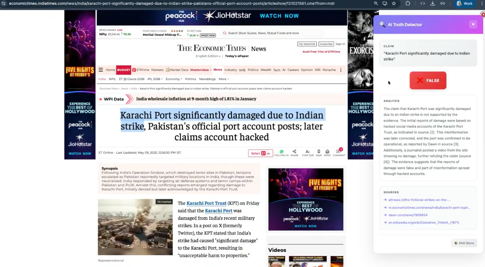
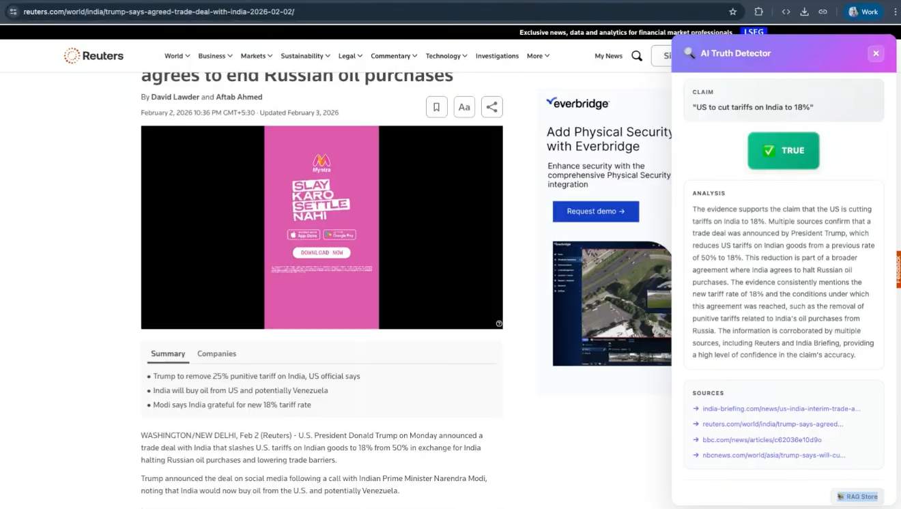

# AI News Claim Verifier

An **Agentic RAG** (Retrieval-Augmented Generation) system for verifying claims and detecting misinformation, built with LangChain, LangGraph, ChromaDB, Tavily, and FastAPI. Used in-browser via a Chrome extension — highlight any headline, right-click, and get an instant AI-powered verdict with cited sources.

---

## Live Demo

The following walkthrough shows the extension running on real news articles. Each step illustrates a different path through the verification pipeline.

---

### Step 1 — RAG Hit → Verdict: FALSE

> **Claim:** *"Karachi Port significantly damaged due to Indian strike"*  
> **Source:** Economic Times (India/Pakistan conflict coverage)

The claim is checked against the local knowledge base. The **RAG retriever finds relevant evidence** and the LLM concludes the claim is **false** — initial reports were based on hacked social media accounts of the Karachi Port Trust, which were later corrected. The port was confirmed operational.



**What to notice:**
- The `RAG Store` badge in the bottom-right corner — no web search was needed.
- Numbered inline citations `[2]`, `[3]`, `[4]` map to the sources listed below the analysis.
- Confidence was high enough (`evidence_found=True`, `confidence > 0.7`) to skip the web fallback.

---

### Step 2 — RAG Miss → Web Search → Verdict: TRUE

> **Claim:** *"US to cut tariffs on India to 18%, India agrees to end Russian oil purchases"*  
> **Source:** Reuters (February 2026 trade deal)

This is a recent news story **not yet in the local knowledge base**. The retriever finds no sufficient evidence, so the agent falls back to **Tavily web search**, fetches 5 live results, and re-evaluates.


**What to notice:**
- The `WEB` badge — the answer came from live web results, not local storage.
- Multiple corroborating sources (Reuters, India Briefing, NBC News, BBC, IP Defense Forum) are all cited.
- The analysis acknowledges a nuance: the joint statement did not explicitly mention the Russian oil commitment, but the overall evidence strongly supports the claim.
- Behind the scenes, all 5 web results are now being **chunked, embedded, and stored** in ChromaDB for future queries.

---

### Step 3 — RAG Hit (after web sync) → Verdict: TRUE

> **Claim:** *"US to cut tariffs on India to 18%"*  
> **Source:** Same Reuters article as Step 2

Immediately after Step 2, the web search results were synced back into the vector store. A follow-up claim about the **same topic** now hits the local knowledge base directly — no web call needed.



**What to notice:**
- The badge has switched back to `RAG Store` — the self-improving KB is working.
- The analysis is more confident and concise because the evidence is already clean and pre-retrieved.
- Subsequent queries about this trade deal will always be answered locally, with proper source attribution back to the original Reuters URLs.

---

## How It Works

The system verifies claims through an **LLM-driven** evaluation workflow. There are no hard-coded distance thresholds or similarity cut-offs — the LLM itself decides whether the retrieved evidence is sufficient.

### Step-by-step flow

1. **Retrieve** — The user's claim is run through a hybrid retrieval pipeline:
   - A **vector similarity search** (ChromaDB, cosine) fetches the top-20 semantically similar chunks
   - A **BM25 keyword search** fetches the top-20 keyword-matched chunks from the same corpus
   - Both candidate sets are merged with weighted fusion (70% vector / 30% BM25)
   - A **FlashRank cross-encoder** re-ranks the merged candidates and selects the top 5

2. **Evaluate (RAG)** — The top-5 re-ranked documents are passed to **GPT-4o** along with the claim. The LLM returns a structured `ClaimEvaluation`:
   - `evidence_found` (bool) — did the documents contain relevant information?
   - `confidence` (float, 0.0 – 1.0) — how well does the evidence address the claim?
   - `claim_verdict` (bool) — is the claim true based on the evidence?
   - `verification_data` (str) — detailed analysis

3. **Route** — The agent checks the LLM's own assessment:
   - If `evidence_found=True` **and** `confidence > 0.7` → skip to final output (local KB was sufficient) — badge shows **RAG Store**
   - Otherwise → fall back to web search — badge shows **WEB**

4. **Web Search** — The claim is sent to the **Tavily API** which returns up to 5 web results with titles, URLs, and content snippets.

5. **Evaluate (Web)** — The same GPT-4o evaluation runs again, this time against the web results, producing a fresh `ClaimEvaluation`.

6. **Sync to RAG** — The web results are individually processed: each result is chunked, tagged with rich metadata (`source_url`, `title`, `source_type`, `query`), embedded, and added to ChromaDB with proper source attribution for future citation.

7. **Format Output** — The final verdict is packaged into a structured JSON response and returned to the caller.

### Agent Graph (LangGraph)

The workflow is implemented as a **6-node LangGraph** state machine, compiled once at startup and reused across all requests.

```
          ┌───────────┐
          │   START   │
          └─────┬─────┘
                │
          ┌─────▼─────┐
          │  retrieve  │  Hybrid (Vector + BM25) → FlashRank re-rank → top 5
          └─────┬─────┘
                │
        ┌───────▼────────┐
        │  evaluate_rag  │  GPT-4o: evidence_found? confidence? claim_verdict?
        └───────┬────────┘
                │
        ┌───────▼────────┐
        │     route      │  evidence_found AND confidence > 0.7 ?
        └──┬──────────┬──┘
       Yes │          │ No
           │          │
           │    ┌─────▼────────┐
           │    │  web_search  │  Tavily API → 5 results
           │    └─────┬────────┘
           │          │
           │    ┌─────▼────────┐
           │    │ evaluate_web │  GPT-4o: re-evaluate against web evidence
           │    └─────┬────────┘
           │          │
           │    ┌─────▼────────┐
           │    │ sync_to_rag  │  Chunk + embed web results → ChromaDB
           │    └─────┬────────┘
           │          │
        ┌──▼──────────▼──┐
        │  format_output  │  Build JSON response
        └────────┬────────┘
                 │
           ┌─────▼─────┐
           │    END    │
           └───────────┘
```

### Self-Improving Knowledge Base

Every time the web search path is taken, new knowledge is automatically ingested back into the vector store:
- Each web result is processed individually with its own metadata
- Chunks are tagged with `source_url` (actual URL), `title`, `source_type` ("web"), and the original `query`
- Each chunk is embedded and stored in ChromaDB with full provenance
- Retriever caches are cleared so the next query sees the updated corpus

This means the first query about a new topic triggers a web search, but subsequent queries on the same topic are answered entirely from local knowledge **with proper source citations** — as shown in [Step 2 → Step 3](#step-2--rag-miss--web-search--verdict-true) above.

---

## Project Structure

```
├── src/
│   ├── agents/            # LangGraph agent definitions
│   │   ├── state.py       # Shared agent state & ClaimEvaluation schema
│   │   └── rag_agent.py   # Core RAG agent graph (6-node LangGraph workflow)
│   ├── rag/               # RAG pipeline
│   │   ├── ingestion.py   # Document loading, chunking & text ingestion
│   │   ├── embeddings.py  # OpenAI embedding model setup
│   │   ├── vector_store.py# ChromaDB operations & cache management
│   │   ├── retriever.py   # Hybrid retriever (vector + BM25) & re-ranked retrieval
│   │   └── re_ranker.py   # FlashRank re-ranking via ContextualCompressionRetriever
│   ├── tools/             # Agent tools
│   │   ├── retrieval.py   # Vector store search tool (LangChain @tool)
│   │   └── search.py      # Tavily web search integration
│   ├── api/               # FastAPI application
│   │   ├── app.py         # App factory & CORS middleware
│   │   └── routes.py      # API endpoints (/verify, /ingest, /health)
│   ├── config.py          # Centralised settings (Pydantic Settings)
│   ├── logger.py          # Logging configuration
│   └── main.py            # Entry point (uvicorn)
├── extension/             # Chrome extension for in-browser verification
│   ├── manifest.json      # Extension configuration
│   ├── background.js      # Service worker
│   ├── content.js         # Content script
│   ├── popup.html/css/js  # Extension popup UI
│   └── README.md          # Extension installation guide
├── scripts/
│   └── ingest.py          # CLI script for document ingestion
├── tests/                 # Test suite
├── data/
│   └── Google.txt         # Sample knowledge base (Google article)
├── requirements.txt
├── pyproject.toml
└── .env.example
```

## Quick Start

### 1. Clone & enter the repo

```bash
git clone <repo-url>
cd ai-league-truth-detector
```

### 2. Create a virtual environment

```bash
python -m venv .venv
source .venv/bin/activate   # macOS/Linux
# .venv\Scripts\activate    # Windows
```

### 3. Install dependencies

```bash
pip install -r requirements.txt
```

### 4. Configure environment

```bash
cp .env.example .env
```

Edit `.env` and add your API keys:

```bash
# Required: OpenAI API key for LLM and embeddings
OPENAI_API_KEY=your-openai-api-key-here

# Required: Tavily API key for web search fallback
TAVILY_API_KEY=your-tavily-api-key-here
```

**Getting API Keys:**
- OpenAI: https://platform.openai.com/api-keys
- Tavily: https://tavily.com/ (sign up for free API access)

### 5. Ingest documents

The repo ships with `data/Google.txt` (a comprehensive article about Google). Ingest it into the vector store:

```bash
python -m scripts.ingest
```

You can also add more `.txt` files to the `data/` directory and re-run the command.

### 6. Start the API server

```bash
python -m src.main
```

The server starts at **http://localhost:8000**. API docs are available at **http://localhost:8000/docs**.

### 7. Install the Chrome Extension (Optional)

For in-browser claim verification:

1. Open Chrome and go to `chrome://extensions/`
2. Enable **Developer mode** (top-right toggle)
3. Click **Load unpacked** and select the `extension/` folder
4. Highlight text on any webpage, right-click, and select **"Verify claim"**

See [`extension/README.md`](extension/README.md) for detailed instructions.

---

## API Endpoints

| Method | Endpoint            | Description                                    |
|--------|---------------------|------------------------------------------------|
| GET    | `/api/v1/health`    | Health check                                   |
| POST   | `/api/v1/verify`    | Verify a claim (with intelligent web fallback) |
| POST   | `/api/v1/ingest`    | Trigger document ingestion from `data/` folder |

### Request / Response

**POST `/api/v1/verify`**

Request body:
```json
{
  "claim": "Google was founded on September 4, 1998."
}
```

Response body:
```json
{
  "claim": "Google was founded on September 4, 1998.",
  "verification_data": "The evidence confirms that Google was founded on September 4, 1998, by Larry Page and Sergey Brin while they were PhD students at Stanford University.",
  "evidence_source": "RAG Store",
  "source_urls": ["data/Google.txt"],
  "claim_verdict": true
}
```

- `evidence_source` is `"RAG Store"` when answered from local knowledge, or `"WEB"` when web search was used.
- `source_urls` contains the actual URLs or file paths where evidence was found (enables proper citation).

### Example: Verify claims

#### Claims about Google (answered from local knowledge base)

```bash
curl -X POST http://localhost:8000/api/v1/verify \
  -H "Content-Type: application/json" \
  -d '{"claim": "Google was founded on September 4, 1998, by Larry Page and Sergey Brin."}'
```

```bash
curl -X POST http://localhost:8000/api/v1/verify \
  -H "Content-Type: application/json" \
  -d '{"claim": "Google received its first funding of $100,000 from Andy Bechtolsheim, co-founder of Sun Microsystems."}'
```

```bash
curl -X POST http://localhost:8000/api/v1/verify \
  -H "Content-Type: application/json" \
  -d '{"claim": "Jeff Bezos is the current CEO of Google."}'
```

```bash
curl -X POST http://localhost:8000/api/v1/verify \
  -H "Content-Type: application/json" \
  -d '{"claim": "In 2015, Google was reorganized as a wholly owned subsidiary of Alphabet Inc."}'
```

#### Claims requiring web search (not in local KB)

```bash
curl -X POST http://localhost:8000/api/v1/verify \
  -H "Content-Type: application/json" \
  -d '{"claim": "The Eiffel Tower is located in Paris, France."}'
```

```bash
curl -X POST http://localhost:8000/api/v1/verify \
  -H "Content-Type: application/json" \
  -d '{"claim": "Python 3.12 was released in October 2023."}'
```

After web search, retrieved information is automatically synced to the vector store. Subsequent queries about the same topic will use cached local knowledge.

---

## Configuration

All settings are loaded from `.env` (or environment variables) via Pydantic Settings.

| Variable | Default | Description |
|----------|---------|-------------|
| `OPENAI_API_KEY` | `""` | OpenAI API key (required) |
| `OPENAI_MODEL` | `gpt-4o` | LLM model for claim evaluation |
| `OPENAI_EMBEDDING_MODEL` | `text-embedding-3-small` | Embedding model |
| `TAVILY_API_KEY` | `""` | Tavily API key for web search (required) |
| `CHROMA_PERSIST_DIR` | `./chroma_db` | ChromaDB storage directory |
| `CHROMA_COLLECTION_NAME` | `truth_detector` | ChromaDB collection name |
| `CHUNK_SIZE` | `1000` | Document chunk size (characters) |
| `CHUNK_OVERLAP` | `200` | Overlap between chunks |
| `RETRIEVER_TOP_K` | `20` | Candidates from each retriever (vector + BM25) |
| `RETRIEVER_TOP_N` | `5` | Final documents after re-ranking |
| `API_HOST` | `0.0.0.0` | Server bind address |
| `API_PORT` | `8000` | Server port |
| `LOG_LEVEL` | `INFO` | Logging level |

### Resetting the Vector Store

To clear all stored embeddings and start fresh:

```bash
rm -rf ./chroma_db
```

Then re-ingest your documents:

```bash
python -m scripts.ingest
```

---

## Running Tests

```bash
pytest
```

---

## Tech Stack

| Component | Technology | Purpose |
|-----------|-----------|---------|
| Agent orchestration | **LangGraph** | State machine graph for the verification workflow |
| LLM framework | **LangChain** + **langchain-classic** | Retriever abstractions, structured output, tool integration |
| LLM | **OpenAI GPT-4o** | Claim evaluation with structured JSON output |
| Embeddings | **OpenAI text-embedding-3-small** | Document and query embedding |
| Vector store | **ChromaDB** (cosine similarity) | Persistent local vector storage |
| Keyword search | **BM25** (rank-bm25) | Sparse retrieval for hybrid search |
| Re-ranking | **FlashRank** | Cross-encoder re-ranking of retrieval candidates |
| Web search | **Tavily** | Real-time web search fallback |
| API | **FastAPI** + **uvicorn** | REST API with auto-generated OpenAPI docs |
| Configuration | **Pydantic Settings** | Type-safe settings from `.env` |
| Logging | **Loguru** | Structured logging throughout the pipeline |

---

## Chrome Extension

The project includes a Chrome extension for verifying claims directly from any webpage:

- **Highlight text** → Right-click → "Verify claim"
- Beautiful popup with verification results
- Works with the local backend (no external services)
- Real-time status indicator

**Quick Install:**
1. Go to `chrome://extensions/`
2. Enable Developer mode
3. Load unpacked → select `extension/` folder
4. Start using it on any webpage!

See [`extension/README.md`](extension/README.md) for full documentation.

---

## Contributing

1. Create a feature branch from `main`
2. Make your changes
3. Run `pytest` and `ruff check .` before pushing
4. Open a pull request
